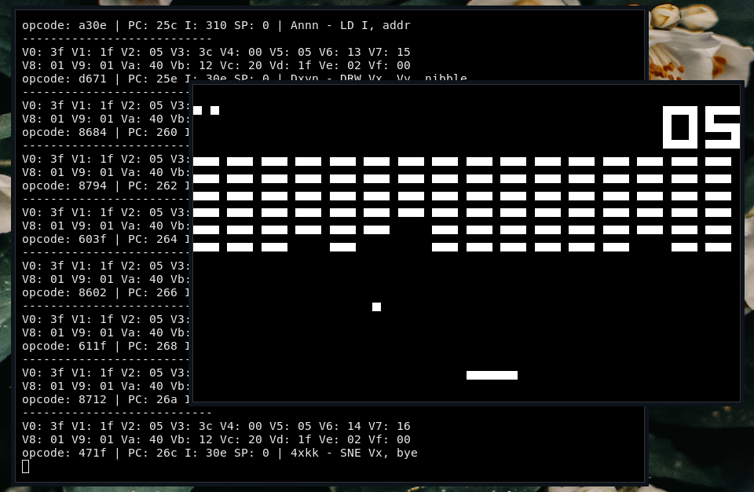

# chip8
CHIP-8 is an interpreted programming language, developed by Joseph Weisbecker. It was initially used on the COSMAC VIP and Telmac 1800 8-bit microcomputers in the mid-1970s. It was made to allow video games to be more easily programmed for these computers. 



## Keymap

```
Your Keyboard           CHIP-8 Keyboard
  +-+-+-+-+                +-+-+-+-+
  |1|2|3|4|                |1|2|3|C|
  +-+-+-+-+                +-+-+-+-+
  |Q|W|E|R|                |4|5|6|D|
  +-+-+-+-+       =>       +-+-+-+-+
  |A|S|D|F|                |7|8|9|E|
  +-+-+-+-+                +-+-+-+-+
  |Z|X|C|V|                |A|0|B|F|
  +-+-+-+-+                +-+-+-+-+
```
